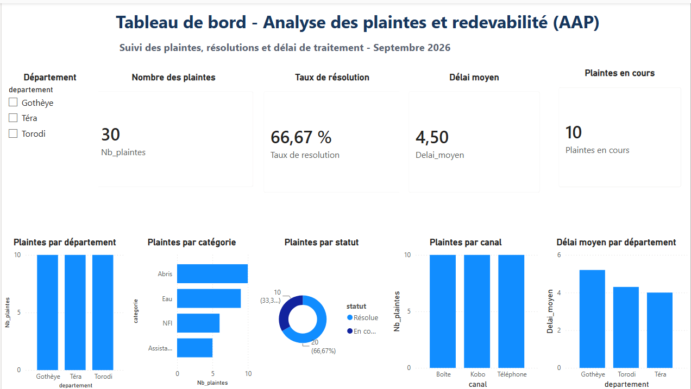

# AAP & Complaints Analysis

## Overview

This project analyzes fictional complaints and accountability data in a humanitarian context.

The objective is to understand the types of issues reported by community members, monitor complaint resolution and analyze response times.

## Context

Accountability to Affected Populations (AAP) is an important component of humanitarian programming.

Complaint and feedback data can help organizations identify recurring issues, monitor response mechanisms and support evidence-based decision-making.

This portfolio project simulates an accountability dataset and demonstrates how such data can be transformed into an analytical dashboard.

## Key questions

- How many complaints were recorded?
- What are the main complaint categories?
- What proportion of complaints were resolved?
- What is the average resolution time?
- How do complaints vary by department?
- How many complaints remain in progress?

## Data

The dataset contains fictional complaint records with information such as:

- Complaint category
- Department
- Complaint status
- Resolution time
- Complaint identifier

## Key indicators

- Number of complaints
- Resolution rate
- Average resolution time
- Complaints by category
- Complaints by department
- Complaints in progress

## Dashboard

The Power BI dashboard provides an overview of complaint patterns, resolution status and response performance.

## Tools

- MySQL
- SQL
- Power BI
- DAX
- Power Query

## Workflow

Data → SQL/MySQL → Data preparation → Data modeling → DAX → Power BI → Dashboard → Insights

## Skills demonstrated

- SQL querying
- Data cleaning
- Data preparation
- Data modeling
- DAX measures
- KPI development
- Accountability data analysis
- Data visualization
- Dashboard design

## Dashboard Preview

## Disclaimer

This is an independent portfolio project using fictional data.

The dataset does not represent real complaints or actual humanitarian beneficiaries.
