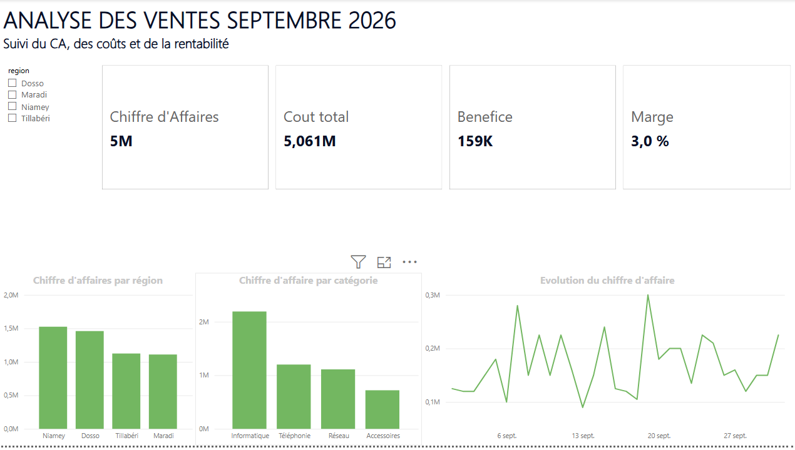

# Sales & Profitability Analysis

## Overview

This project analyzes fictional sales data to understand revenue, costs and profitability across products and regions.

The objective is to transform transactional data into business insights that can support performance monitoring and decision-making.

## Key questions

- What is the total revenue?
- What is the total cost?
- What is the overall profit?
- Which regions generate the most revenue?
- Which products perform best?
- How does profitability vary by region?

## Tools

- Excel
- Power BI
- Power Query
- DAX

## Data model

The project uses a simple star-schema approach with:

- Sales transactions
- Products
- Regions

## Key indicators

- Revenue
- Total cost
- Profit
- Profit margin
- Revenue by region
- Revenue by product
- Profit by region

## Workflow

Excel → Power Query → Data model → DAX → Power BI → Dashboard → Insights

## Skills demonstrated

- Excel data preparation
- Data modeling
- DAX measures
- KPI development
- Profitability analysis
- Data visualization
- Dashboard design

## Disclaimer

This is an independent portfolio project using fictional data.
## Dashboard Preview

